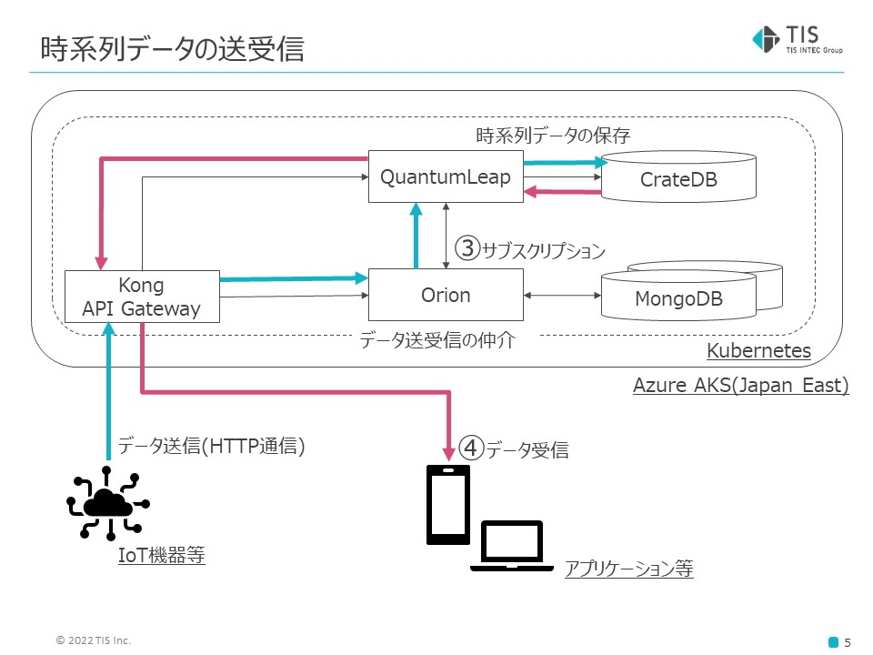

# 会津ハッカソンFIWARE利用説明

## 基盤について

### 基盤全体像


### 基盤について

ご提供させて頂いた基盤で利用できる機能は以下の通りです。
* Orionのブローカー機能
* 時系列データの格納と取得

利用方法は次の章でご説明致します。

## Orionのブローカー機能について


データの形式はNGSIv2です。   
以下にサンプルを提示します。

```
{
  "id": "Room1",
  "type": "Room",
  "temperature": {
     "value": 23.3,
     "type": "Number",
     "metadata": {}
  },
  "pressure": {
     "value": 711,
     "type": "Number",
     "metadata": {}
  }
}
```

NGSIv2形式は大きく3つのブロックに分かれています。

* Entity
    * 実世界のモノや空間を示します。
    * 観測対象により粒度を決めていきます。
    * 今回の例ではRoomという部屋がEntityとなります。 
* Attribute
    * Entityから観測される値を示します。
    * 今回の例ではtemperature(気温)とpressure(気圧)がAttributeになります。
* Metadata
    * メタ的なデータを指します。
    * 記述するかは任意になります。

上記のようなNGSIv2形式のデータをFIWAREでは扱っています。

### ①データの追加方法

orionへデータを送信する際はHTTP通信を利用しています。  
以下のコマンドをラズベリーパイ等の機器に登録しておくことでデータを送信することが可能です。

* JsonファイルにNGSIv2形式でデータを記述し、送信する場合
```
curl https://orion.c-3lab.org/v2/entities /
-H "Content-Type: application/json" /
-H "Authorization: API_KEY" /
-H "Fiware-Service: TENANT_NAME" -X POST -d @ ./JSON_FILE
```

* データをコマンド内に埋め込み送信する場合
```
curl https://orion.c-3lab.org/v2/entities /
-H "Content-Type: application/json" /
-H "Authorization: API_KEY" /
-H "Fiware-Service: TENANT_NAME" -X POST -d @- <<EOF
{
  "id": "Room1",
  "type": "Room",
  "temperature": {
    "value": 23,
    "type": "Float"
  },
  "pressure": {
    "value": 720,
    "type": "Integer"
  }
}
EOF
```

### データの取得

orionからデータを受信する際もHTTP通信を利用します。
以下のコマンドから受け取ることが出来ます。

```
curl https://orion.c-3lab.org/v2/entities /
-H "Authorization: API_KEY" /
-H "Fiware-Service: TENANT_NAME"
```

entities以下のパスを指定することでアトリビュートの値などを取得することが出来ます。  
以下がその一例です。(気温のvalueを取り出す)

```
curl https://orion.c-3lab.org/v2/entities/Room1/attrs/temperature/value /
-H "Authorization: API_KEY" /
-H "Fiware-Service: TENANT_NAME"
```

その他については以下の学習コンテンツPart2をご参照ください。
* https://github.com/c-3lab/fiware-learning-handson

### データ全体の更新

データを更新したい場合はEntity名を指定し、更新を行います。  

* JsonファイルにNGSIv2形式でデータを記述し、送信する場合
```
curl https://orion.c-3lab.org/v2/entities/ENTITY_NAME/attrs /
-H "Content-Type: application/json" /
-H "Authorization: API_KEY" /
-H "Fiware-Service: TENANT_NAME" -X PUTCH -d @ ./JSON_FILE
```

* データをコマンド内に埋め込み送信する場合
```
curl https://orion.c-3lab.org/v2/entities/ENTITY_NAME/attrs /
-H "Content-Type: application/json" /
-H "Authorization: API_KEY" /
-H "Fiware-Service: TENANT_NAME" -X PUTCH -d @- <<EOF
{
  "id": "Room1",
  "type": "Room",
  "temperature": {
    "value": 30,
    "type": "Float"
  },
  "pressure": {
    "value": 650,
    "type": "Integer"
  }
}
EOF
```

### データ一部の更新

データを一部更新したい場合はURLのパスでEntity名とAttribute名を指定します。  
以下が一例です。(Room1のtemperatureを30.0に変更している。)

```
curl https://orion.c-3lab.org/v2/entities/Room1/attrs/temperature/value /
-H "Content-Type: text/plain" /
-H "Authorization: API_KEY" /
-H "Fiware-Service: TENANT_NAME" /
-X PUT -d 30.0
```

## 時系列データの利用方法



### 時系列データの登録

時系列データはQuantumleapというサービスで取り扱っています。  
このQuantumleapにデータを入れるにはOrionを通す必要があります。  
orionがデータをQuantumleapへ流すために必要な設定がサブスクリプション設定になります。  
以下にサブスクリプションを設定するための例を提示します。

```
curl -i https://orion.c-3lab.org/v2/subscriptions /
-H "Content-Type: application/json" /
-H "Authorization: API_KEY" /
-H "Fiware-Service: TENANT_NAME" /
-H "fiware-servicepath: /" /
-d @- <<EOF
{
  "description": "DESCRIPTION_ABOUT_THIS_SUBSCRIPTION",
  "subject": {
      "entities": [
      {
          "idPattern": "Room1",
          "type": "Room"
      }
      ],
      "condition": {
          "attrs": [
          "temperature"
          "pressure"
          ]
      }
  },
  "notification": {
      "http": {
          "url": "http://quantumleap:8668/v2/notify"
      },
      "attrs": [
      "tempreture",
      "pressure",
      ],
      "metadata": ["dateCreated", "dateModified"]
  },
  "throttling": 1
}
EOF
```

上記の設定はRoom1のエンティティの気温と気圧に変更があった際に  
気温と気圧の情報をQuantumleapに送信する設定を示しています。

このサブスクリプション設定を行い、Orionにデータを追加または更新します。
そうすることでデータがQuantumleapに自動で送られ、時系列データとして取り扱われます。  

### 時系列データの取得

時系列データとして扱われているデータの取り出しはQuantumleapから直接行います。  
登録されているすべてのデータを取得する例を以下に提示します。

```
curl https://quantumleap.c-3lab.org/v2/entities /
-H "Authorization: API_KEY" /
-H "Fiware-Service: TENANT_NAME" /
-H "fiware-servicepath: /"
```

entities以下のパスを指定することでアトリビュートやタイプごとのデータ取得が可能です。  
以下に例を提示します。(Room1のtemperatureの時系列データを取得している)

```
curl https://quantumleap.c-3lab.org/v2/entities/Room1/attrs/temperature/value / 
-H "Authorization: API_KEY" /
-H "Fiware-Service: TENANT_NAME" /
-H "fiware-servicepath: /"
```

以下のURLにパスの指定方法が記載されている公式のドキュメントがありますので、queriesの欄をご参照ください。  
	※GET以外のAPIは利用を制限させていただいております。ご了承ください。  
* https://app.swaggerhub.com/apis/smartsdk/ngsi-tsdb/0.8.3#/